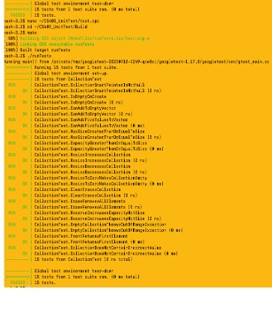
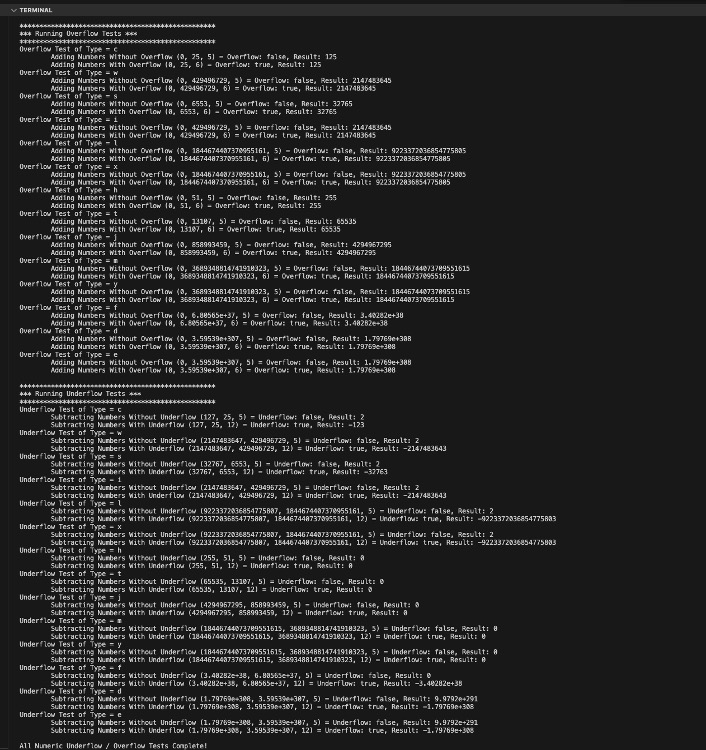
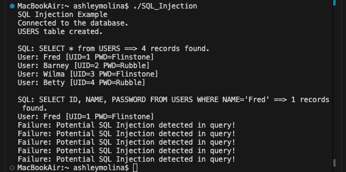

# Secure Coding & Unit Testing (C++)

This repository demonstrates secure software development principles, defensive programming techniques, and unit testing practices implemented in C++ as part of advanced coursework in software security and quality assurance.

The project focuses on writing maintainable, secure code while validating functionality through structured testing and debugging practices.

---
## Project Screenshots

### Google Test Fixture
This test uses the Google Test Framework to validate application functionality through automated unit testing. The test suite verifies expected behavior across multiple scenarios and confirms successful execution of all test cases.

### Numeric Overflow & Underflow Testing

Boundary-value testing was performed to validate application behavior when processing numeric overflow and underflow conditions across multiple data types. These tests demonstrate defensive programming techniques and validation of edge-case behavior.

## SQl Injection Testing

Implemented Regex-based input validation to detect and block common SQL injection patterns before database execution, preventing malicious queries and demonstrating secure coding practices.

## Skills Demonstrated

- Secure Coding Principles
- Unit Testing
- Defensive Programming
- Input Validation
- Debugging and Troubleshooting
- C++ Development
- Software Quality Assurance
- Code Review and Refactoring

---

## Technologies

- C++
- Visual Studio
- Git
- GitHub

---

## Project Highlights

- Developed C++ applications using secure coding practices.
- Implemented unit tests to validate application functionality.
- Identified and corrected software defects through debugging and testing.
- Applied defensive programming techniques to improve application reliability.
- Strengthened understanding of secure software development lifecycle principles.

---

## Learning Outcomes

This project strengthened practical experience in:

- Writing secure, maintainable software
- Validating software through unit testing
- Identifying vulnerabilities and improving code quality
- Debugging and resolving implementation issues
- Applying software engineering best practices

---

## Disclaimer

This repository contains coursework completed for educational purposes and is intended to demonstrate software engineering, testing, and secure coding skills.

---

## Developer

**Ashley Molina-Runez**  
Software Engineer  
Luxovia Systems LLC
